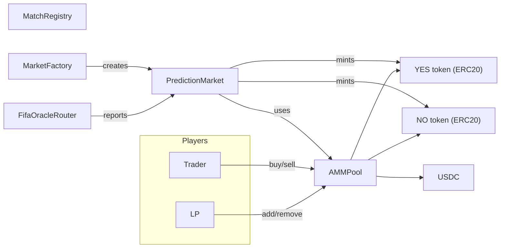
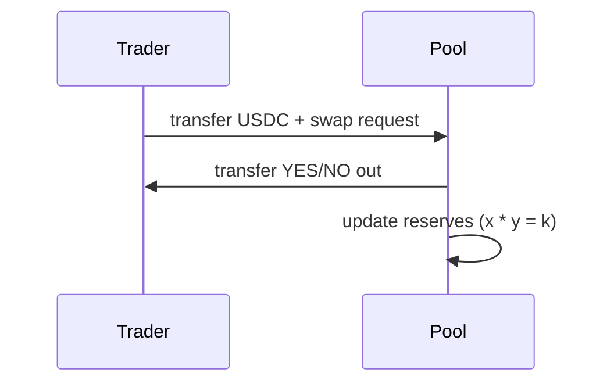

# Prediction Markets — World Cup AMM-style yes/no markets ⚽️📈

 Implementing  a small prediction-market stack (built with Foundry) that demonstrates how to deploy per-match yes/no markets, an AMM for outcome-token swaps, tokenized outcome shares, and oracle adapters for reporting results. The code was written for the Speedrun Ethereum / prediction markets challenge but is organized as a reusable minimal stack.

Preview


Highlights
- Per-match markets with dedicated YES/NO ERC20 outcome tokens (`PredictionMarketToken`)
- AMM pool (USDC <> YES/NO) with LP shares and swap math (`FifaAMMPool`)
- Factory & registry to deploy markets at scale (`FifaMarketFactory`, `FifaTournamentRegistry`)
- Oracle adapters: Chainlink-friendly and signed-relayer router (`FifaChainlinkResultOracle`, `FifaOracleRouter`)
- Built with Foundry (forge) and OpenZeppelin libraries

Quick links
- Speedrun challenge: https://speedrunethereum.com/challenge/prediction-markets
- Foundry (forge): https://book.getfoundry.sh/
- OpenZeppelin ERC20 & AccessControl: https://docs.openzeppelin.com/
- Chainlink oracles: https://docs.chain.link/
- AMM constant-product math (Uniswap v2): https://uniswap.org/docs/v2/

## Project overview

The stack models a sports match prediction market where:
- Each match has a `PredictionMarket` deployed with a pair of `PredictionMarketToken` (YES/NO)
- An `AMMPool` backs trading between USDC and outcome tokens (constant-product style, with protocol fee)
- A `MarketFactory` + `MatchRegistry` create markets and record metadata
- Oracle adapters (router / Chainlink bridge) report results to the market; the market then allows winners to redeem USDC

## Architecture diagram

Below is a simple diagram showing how the main pieces connect (factory/registry, market, AMM pool, outcome tokens, oracle router, and users).



## How the AMM & market work (short)

- AMM invariant: the pool enforces a constant-product style relation between outcome token reserves and USDC (x * y = k). This guarantees liquidity for trades and moves prices as reserves change.
- Swap flow (simplified): a trader sends USDC to the AMM, the pool calculates output using reserve math (getAmountOut), transfers outcome tokens to the trader, and updates reserves.
- LP flow: liquidity providers deposit USDC + equal outcome-token amounts and receive LP shares representing their fraction of the pool; removing liquidity burns LP shares and returns proportional reserves.

### Trade sequence (visual)



## Component responsibilities (one-liners)

- `FifaMarketFactory` — deploys per-match markets, outcome tokens and AMM pools; wires them into the `MatchRegistry`.
- `MatchRegistry` — stores match metadata and market address lookup (used by oracle adapters).
- `FifaPredictionMarket` — market lifecycle, gateway for trading via the AMM, liquidity ops, and final redemption after oracle report.
- `FifaAMMPool` — core pool contract implementing swaps, LP accounting, and winner payout logic.
- `PredictionMarketToken` — simple ERC20 outcome tokens (YES/NO) minted/burned only by the market.
- `FifaOracleRouter` / `FifaChainlinkResultOracle` — adapters for oracle reporting (direct node or signed-relayer patterns).

---

## Files (short descriptions)

Top-level
- `foundry.toml` — Foundry configuration for compiling and testing.

Contracts (`/src`)
- `AccessControlRoles.sol` — shared role constants (ORACLE_ROLE, MARKET_CREATOR_ROLE).
- `FifaPredictionMarket.sol` (`PredictionMarket`) — per-match market that handles buys/sells via the AMM, liquidity management, lifecycle (OPEN → CLOSED → REPORTED → RESOLVED) and redemption of winning outcome tokens.
- `PredictionMarketToken.sol` — minimal ERC20 outcome token with a single `minter` role for the market contract (mint/burn restricted).
- `FifaAMMPool.sol` (`AMMPool`) — on-chain AMM that holds USDC, YES and NO balances, implements swaps, LP accounting, and pays out winners after resolution.
- `FifaMarketFactory.sol` (`MarketFactory`) — factory that deploys outcome tokens, AMM pool and market, and registers the match in the registry.
- `FifaTournamentRegistry.sol` (`MatchRegistry`) — simple registry mapping match IDs to metadata and deployed market address.
- `FifaOracleRouter.sol` — router that accepts direct oracle node submissions or relayed signed results; forwards validated outcomes to the market found in the registry.
- `FifaChainlinkResultOracle.sol` — minimal Chainlink-friendly oracle adapter that can request and receive results from a node (emits events expected by off-chain node).

Interfaces (`/Interfaces`)
- `IResultOracle.sol` — oracle request/report interface.
- `IAMMPool.sol` — pool interface used by `PredictionMarket` to perform swaps and liquidity ops.
- `IPredictionMarket.sol` — minimal market interface (reportOutcome).
- `IOutcomeToken.sol` — outcome-token (mint/burn/setMinter) ERC20 extension.
- `IMatchRegistry.sol` — read-only registry interface.

Scripts (`/script`)
- `DeployPredictionMarket.s.sol` — minimal deploy script for a single market (used with `forge script`).
- `DeployFifaMarketStack.s.sol` — deploys registry, factory, router and a market plus initial liquidity (example stack deploy).

Tests (`/test`)
- `AMMPool.t.sol` — tests for pool swaps, LP accounting and math.
- `MarketFactory.t.sol` — tests for factory and registry flows.
- `MarketLifecycle.t.sol` — market lifecycle (open/close/report/redeem) scenarios.
- `OracleRouter.t.sol` — oracle router signing/relayer behaviors.
- `PredictionMarket.t.sol` — end-to-end market behaviors and edge cases.

## How to build & test

Install Foundry: https://book.getfoundry.sh/getting-started/installation

Run the full test suite locally:

```bash
forge test --optimize --force
```

Run a single test file:

```bash
forge test --match-path test/PredictionMarket.t.sol
```

## Deploying (examples)

The scripts use environment variables. Example variables used by `script/DeployFifaMarketStack.s.sol` and `DeployPredictionMarket.s.sol`:

- `PRIVATE_KEY` — deployer private key (used by Foundry `vm.env*` helpers)
- `USDC_ADDRESS` — USDC token contract used as collateral on-chain
- `ORACLE_ADDRESS` / `ORACLE_NODE_ADDRESS` — address of oracle adapter or node
- `MATCH_ID`, `KICKOFF_TIME`, `HOME_TEAM`, `AWAY_TEAM`, `INITIAL_LIQUIDITY` — match metadata and liquidity

Example (local/private network):

```bash
export PRIVATE_KEY=0x...
export USDC_ADDRESS=0x...
export ORACLE_NODE_ADDRESS=0x...
export MATCH_ID=1234
export KICKOFF_TIME=1700000000
export HOME_TEAM="Brazil"
export AWAY_TEAM="Argentina"
forge script script/DeployFifaMarketStack.s.sol --broadcast --rpc-url <RPC>
```

Notes: scripts expect the broadcasting account to hold and approve USDC where appropriate.

## Design notes & security considerations

- Outcome tokens are simple ERC20s where only the market may mint/burn.
- The AMM uses constant-product swap math with a small fee (configured in factory). Slippage protections are present via minAmount parameters.
- Oracles: deliver results via either a trusted oracle node or a signed-relayer pattern — signature replay protection is implemented in the router.
- Access control uses OpenZeppelin's `AccessControl` and a small set of role constants.

Security pointers (non-exhaustive):
- Carefully review roles and admin owners before production deployment.
- Consider timelocks, multisigs, or governance for role management.
- Audit the math for edge cases (zero reserves, rounding, fee calculations).

## Related reading

- Foundry book — https://book.getfoundry.sh/
- OpenZeppelin Contracts — https://github.com/OpenZeppelin/openzeppelin-contracts
- Chainlink documentation — https://docs.chain.link/
- Uniswap V2 constant product AMM — https://uniswap.org/docs/v2/
- ECDSA signature patterns — https://docs.openzeppelin.com/contracts/4.x/api/utils#ECDSA


